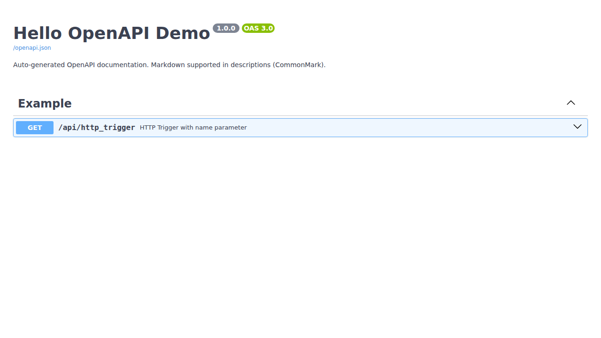

# azure-functions-openapi

[](https://pypi.org/project/azure-functions-openapi/)
[](https://pypi.org/project/azure-functions-openapi/)
[](https://github.com/yeongseon/azure-functions-openapi/actions/workflows/test.yml)
[](https://codecov.io/gh/yeongseon/azure-functions-openapi)
[](https://pre-commit.com/)
[](https://yeongseon.github.io/azure-functions-openapi/)
[](LICENSE)

> Effortless OpenAPI (Swagger) documentation & Swagger‑UI for **Python Azure Functions**.

---

## Features

### Core Features
- `@openapi` decorator — annotate once, generate full spec
- Serves `/openapi.json`, `/openapi.yaml`, and `/docs` (Swagger UI)
- Supports query/path/header parameters, requestBody, responses, tags
- Optional Pydantic integration (supports both v1 and v2)
- Zero hard dependency on Pydantic

### Security & Performance
- **Enhanced Security**: CSP headers, input validation, XSS protection
- **Performance Caching**: In-memory caching with TTL and LRU eviction
- **Error Handling**: Standardized error responses with detailed logging
- **Input Sanitization**: Automatic sanitization of routes, operation IDs, and parameters

### Monitoring & Operations
- **Health Checks**: Built-in health monitoring for all components
- **Performance Metrics**: Response time tracking, throughput monitoring
- **Request Logging**: Detailed request/response logging with statistics
- **Server Information**: Comprehensive server info and runtime details

### Developer Experience
- **CLI Tool**: Command-line interface for spec generation, validation, and monitoring
- **Comprehensive Testing**: 97% test coverage with extensive test suites
- **Documentation**: Detailed guides for security, performance, and CLI usage
- **Type Safety**: Full type hints and validation throughout

---

## Installation

```bash
pip install azure-functions-openapi
```

For local development:

```bash
git clone https://github.com/yeongseon/azure-functions-openapi.git
cd azure-functions-openapi
pip install -e .[dev]
```

---

## Quick Start

> Create a minimal HTTP-triggered Azure Function with auto Swagger documentation.

1. Set up environment
```bash
python -m venv .venv
source .venv/bin/activate
pip install azure-functions azure-functions-worker azure-functions-openapi
```

2. Initialize Azure Functions project
```bash
func init hello_openapi --python
cd hello_openapi
```

3. Add `function_app.py` with OpenAPI-decorated function and endpoints:
```python
# hello_openapi/function_app.py

import json
import azure.functions as func
from azure_functions_openapi.decorator import openapi
from azure_functions_openapi.openapi import get_openapi_json, get_openapi_yaml
from azure_functions_openapi.swagger_ui import render_swagger_ui

app = func.FunctionApp()

@openapi(
    summary="Greet user",
    route="/api/http_trigger",
    request_model={"name": "string"},
    response_model={"message": "string"},
    tags=["Example"]
)
@app.function_name(name="http_trigger")
@app.route(route="/api/http_trigger", auth_level=func.AuthLevel.ANONYMOUS, methods=["POST"])
def main(req: func.HttpRequest) -> func.HttpResponse:
    try:
        data = req.get_json()
        name = data.get("name", "world")
        return func.HttpResponse(
            json.dumps({"message": f"Hello, {name}!"}),
            mimetype="application/json"
        )
    except Exception as e:
        return func.HttpResponse(f"Error: {str(e)}", status_code=400)

@app.function_name(name="openapi_json")
@app.route(route="/api/openapi.json", auth_level=func.AuthLevel.ANONYMOUS, methods=["GET"])
def openapi_json(req: func.HttpRequest) -> func.HttpResponse:
    return get_openapi_json()

@app.function_name(name="openapi_yaml")
@app.route(route="/api/openapi.yaml", auth_level=func.AuthLevel.ANONYMOUS, methods=["GET"])
def openapi_yaml(req: func.HttpRequest) -> func.HttpResponse:
    return get_openapi_yaml()

@app.function_name(name="swagger_ui")
@app.route(route="/api/docs", auth_level=func.AuthLevel.ANONYMOUS, methods=["GET"])
def swagger_ui(req: func.HttpRequest) -> func.HttpResponse:
    return render_swagger_ui()
```
>  Swagger UI (`/docs`) is now supported via `render_swagger_ui()` helper.

4. Run locally:
```bash
func start
```

- OpenAPI JSON: http://localhost:7071/api/openapi.json
- Swagger UI: http://localhost:7071/api/docs

5. Deploy:
```bash
func azure functionapp publish <FUNCTION-APP-NAME> --python
```

- OpenAPI JSON: https://<FUNCTION-APP-NAME>.azurewebsites.net/api/openapi.json

A partial example of the generated `/api/openapi.json`:

```json
{
  "openapi": "3.0.0",
  "info": {
    "title": "API",
    "version": "1.0.0",
    "description": "Auto-generated OpenAPI documentation. Markdown supported in descriptions (CommonMark)."
  },
  "paths": {
    "/api/http_trigger": {
      "get": {
        "summary": "HTTP Trigger with name parameter",
        "description": "Returns a greeting using the **name** from query or body.",
        "parameters": [
          {
            "name": "name",
            "in": "query",
            "required": true,
            "schema": { "type": "string" },
            "description": "Name to greet"
          }
        ],
        "responses": {
          "200": {
            "description": "Successful response with greeting",
            "content": {
              "application/json": {
                "examples": {
                  "sample": {
                    "summary": "Example greeting",
                    "value": {
                      "message": "Hello, Azure!"
                    }
                  }
                }
              }
            }
          },
          "400": { "description": "Invalid request" }
        }
      }
    }
  }
}
```

- Swagger UI: https://<FUNCTION-APP-NAME>.azurewebsites.net/api/docs

Swagger UI will look once you set up the routes:



---

## Example with Pydantic

```python
from pydantic import BaseModel
from azure_functions_openapi.decorator import openapi

class RequestModel(BaseModel):
    name: str

class ResponseModel(BaseModel):
    message: str

@openapi(
    summary="Greet user (Pydantic)",
    route="/api/http_trigger",
    request_model=RequestModel,
    response_model=ResponseModel,
    tags=["Example"]
)
def http_trigger(req: func.HttpRequest) -> func.HttpResponse:
    ...
```

>  Supports both Pydantic v1 and v2.
Schema inference will work automatically with either version.

---

## CLI Tool

The package includes a powerful CLI tool for various operations:

```bash
# Generate OpenAPI specification
azure-functions-openapi generate --title "My API" --version "1.0.0"

# Get server information
azure-functions-openapi info

# Check health status
azure-functions-openapi health

# Get performance metrics
azure-functions-openapi metrics

# Validate OpenAPI specification
azure-functions-openapi validate openapi.json
```

See [CLI Guide](docs/CLI.md) for complete documentation.

## Documentation

- Full docs: [yeongseon.github.io/azure-functions-openapi](https://yeongseon.github.io/azure-functions-openapi/)
- [Quickstart](docs/usage.md)
- [Development Guide](docs/development.md)
- [Contribution Guide](docs/contributing.md)
- [Security Guide](docs/SECURITY.md)
- [Performance Guide](docs/PERFORMANCE.md)
- [CLI Guide](docs/CLI.md)

---

## License

MIT © 2025 Yeongseon Choe
